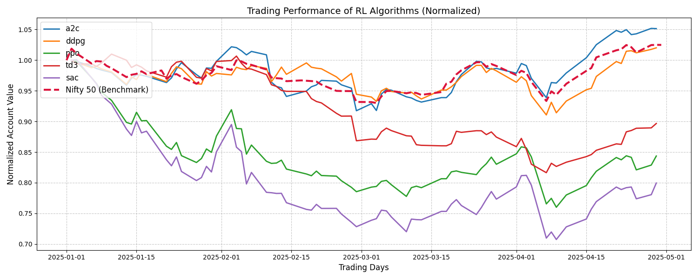

# AI-Driven Portfolio Optimization for Indian Stock Market

## Overview
This project implements a reinforcement learning (RL) framework for portfolio optimization in the Indian stock market. Leveraging advanced RL algorithms (A2C, DDPG, PPO, SAC, TD3), the system dynamically allocates assets and manages risk using historical market data and technical indicators. The project demonstrates the full pipeline: data collection, preprocessing, environment setup, agent training, backtesting, and performance visualization.

---

## Features

- **Data Collection & Preprocessing:**  
  Downloads and processes Indian stock data, engineering features such as MACD, RSI, CCI, Bollinger Bands, and more.

- **Custom Trading Environment:**  
  Utilizes a `StockTradingEnv` compatible with Stable Baselines3, simulating realistic trading with transaction costs and multiple assets.

- **Multiple RL Algorithms:**  
  Supports A2C, DDPG, PPO, SAC, and TD3, allowing for comparative analysis of different agent performances.

- **Backtesting & Evaluation:**  
  Includes robust backtesting on unseen data, with performance metrics (e.g., Sharpe ratio, total reward, drawdown) and visualizations.

- **Benchmarking:**  
  Compares RL strategies against the Nifty 50 index for real-world relevance.

---

## Project Structure

- `main.ipynb` — Main notebook with code, explanations, and results.
- `train_data.csv` — Training data with engineered features.
- `trade_data.csv` — Trading/backtesting data.
- `trained_models/` — Saved RL agent models.
- `results/` — Training logs and performance metrics.
- `results_normalized.png` — Visualization comparing RL agents and Nifty 50.

---

## Data Format

Both `train_data.csv` and `trade_data.csv` contain:
- `date`, `tic` (ticker), `close`, `high`, `low`, `open`, `volume`
- Technical indicators: `macd`, `boll_ub`, `boll_lb`, `rsi_30`, `cci_30`, `dx_30`, `close_30_sma`, `close_60_sma`, `vix`
- Each row represents a stock on a specific date.

---

## How to Run

1. **Install dependencies** (preferably in a virtual environment):
   ```bash
   pip install -r requirements.txt
   ```

2. **Open `main.ipynb`** in Jupyter Notebook or JupyterLab.

3. **Run all cells** sequentially to:
   - Download and preprocess data
   - Set up the trading environment
   - Train RL agents
   - Backtest and visualize results

---

## Results

- RL agents are trained and evaluated on Indian stock data.
- Performance is visualized and compared to the Nifty 50 index.
- Example output:  
  

---

## Usage Example

```python
from finrl.agents.stablebaselines3.models import DRLAgent
agent = DRLAgent(env=env_train)
model_a2c = agent.get_model("a2c")
trained_a2c = agent.train_model(model=model_a2c, tb_log_name='a2c', total_timesteps=50000)
```

---

## Requirements

- Python 3.8+
- Stable Baselines3
- FinRL
- yfinance, pandas, numpy, matplotlib, scikit-learn, etc.

---

## References

- [FinRL Library](https://github.com/AI4Finance-Foundation/FinRL)
- [Stable Baselines3](https://github.com/DLR-RM/stable-baselines3)

---

## License

This project is for educational and research purposes. Please check individual library licenses for commercial use. 